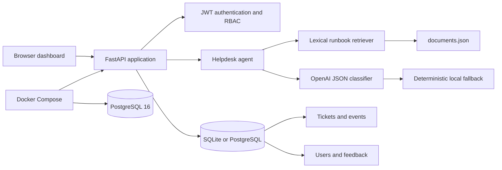
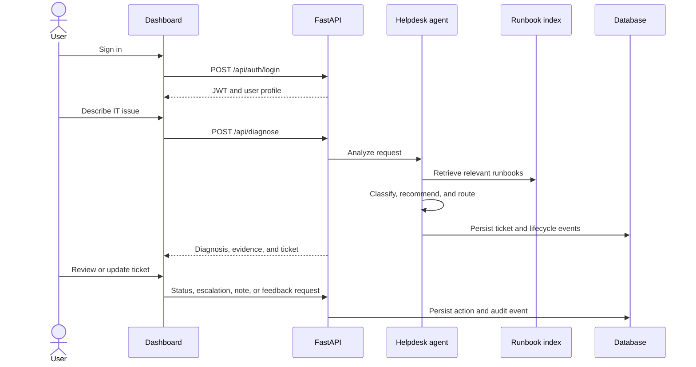

# Relay AI IT Helpdesk

Relay is a production-shaped AI IT helpdesk application. It diagnoses issues, retrieves relevant runbooks, recommends next steps, creates and routes tickets, tracks ticket activity, and protects operations behind JWT authentication and role-based access control.

## Contents

- [Architecture diagram](#architecture-diagram)
- [System workflow](#system-workflow)
- [Feature list](#feature-list)
- [API documentation](#api-documentation)
- [Database schema](#database-schema)
- [AI architecture](#ai-architecture)
- [Security considerations](#security-considerations)
- [Testing](#testing)
- [Docker setup](#docker-setup)
- [CI/CD](#cicd)
- [Screenshots](#screenshots)
- [Demo](#demo)

## Architecture diagram



The browser serves the static dashboard from FastAPI. Protected API routes use the authenticated user from a JWT. The agent combines retrieval and classification before persisting ticket, conversation, and activity data.

## System workflow



## Feature list

- JWT login with persisted users and Argon2 password hashing.
- Role-based access for requesters, agents, managers, and administrators.
- AI diagnosis with intent, confidence, category, priority, actions, and evidence.
- OpenAI JSON-mode classification when `OPENAI_API_KEY` is configured.
- Deterministic local classification fallback for offline demos.
- Runbook search, ingestion, retrieval, and deletion.
- Category-based routing with priority-specific SLA deadlines.
- Automatic and manual ticket escalation.
- Ticket timelines, internal notes, status changes, and actor attribution.
- Conversation persistence for user and assistant messages.
- Agent helpful/not-helpful feedback and summary metrics.
- Responsive dashboard with login gate, queue, ticket modal, knowledge base, and diagnosis results.
- SQLite defaults for local development and PostgreSQL support for Docker deployments.

## API documentation

Start the application and open [http://localhost:8000/docs](http://localhost:8000/docs) for the interactive OpenAPI reference.

Most endpoints require `Authorization: Bearer <token>`. Obtain a token with `POST /api/auth/login`.

### Authentication

| Method | Endpoint | Access | Description |
| --- | --- | --- | --- |
| `POST` | `/api/auth/login` | Public | Authenticate with email and password. |
| `GET` | `/api/auth/me` | Authenticated | Return the current user profile. |
| `GET` | `/api/auth/users` | Admin | List users. |
| `POST` | `/api/auth/users` | Admin | Create a user. |
| `PATCH` | `/api/auth/users/{user_id}/active` | Admin | Activate or deactivate a user. |

### Diagnosis and conversations

| Method | Endpoint | Access | Description |
| --- | --- | --- | --- |
| `POST` | `/api/diagnose` | Authenticated | Diagnose an issue and optionally create a ticket. |
| `POST` | `/api/conversations` | Authenticated | Create a conversation. |
| `GET` | `/api/conversations` | Authenticated | List conversations visible to the user. |
| `GET` | `/api/conversations/{conversation_id}` | Authenticated | Retrieve a conversation and its messages. |
| `POST` | `/api/conversations/{conversation_id}/messages` | Authenticated | Add a message and receive an agent diagnosis. |

### Tickets and activity

| Method | Endpoint | Access | Description |
| --- | --- | --- | --- |
| `GET` | `/api/tickets` | Authenticated | List tickets with `status`, `priority`, and `q` filters. |
| `POST` | `/api/tickets` | Authenticated | Create and route a ticket for the current requester. |
| `GET` | `/api/tickets/{ticket_id}` | Authenticated | Retrieve ticket details. |
| `GET` | `/api/tickets/{ticket_id}/events` | Authenticated | Retrieve the activity timeline. |
| `POST` | `/api/tickets/{ticket_id}/events` | Agent, manager, admin | Add an internal note. |
| `PATCH` | `/api/tickets/{ticket_id}/status` | Agent, manager, admin | Change ticket status. |
| `POST` | `/api/tickets/{ticket_id}/escalate` | Agent, manager, admin | Escalate a ticket and assign a two-hour SLA. |

### Knowledge, feedback, and health

| Method | Endpoint | Access | Description |
| --- | --- | --- | --- |
| `GET` | `/api/docs` | Authenticated | List or search runbooks. |
| `GET` | `/api/docs/{doc_id}` | Authenticated | Retrieve one runbook. |
| `POST` | `/api/docs` | Manager, admin | Add a runbook. |
| `DELETE` | `/api/docs/{doc_id}` | Manager, admin | Delete a runbook. |
| `POST` | `/api/feedback` | Authenticated | Record agent feedback. |
| `GET` | `/api/feedback/summary` | Manager, admin | View feedback totals. |
| `GET` | `/api/stats` | Authenticated | Return dashboard metrics. |
| `GET` | `/api/health` | Public | Check service health. |

## Database schema

SQLAlchemy defines the following tables:

| Table | Purpose | Important fields |
| --- | --- | --- |
| `users` | Authenticated identities | `email`, `password_hash`, `role`, `is_active` |
| `tickets` | Helpdesk work items | `requester_email`, `category`, `priority`, `status`, `sla_due_at` |
| `ticket_events` | Ticket audit timeline | `ticket_id`, `event_type`, `actor`, `message`, `details` |
| `conversations` | User support sessions | `user_email`, `status`, `created_at`, `updated_at` |
| `conversation_messages` | Conversation history | `conversation_id`, `role`, `content`, `payload` |
| `agent_feedback` | Diagnosis feedback | `run_id`, `ticket_number`, `rating`, `comment` |

The local SQLite database is created automatically. Existing SQLite databases receive missing ticket columns during startup. For production schema evolution, use a migration tool such as Alembic instead of startup alteration logic.

## AI architecture

1. The API validates the incoming request with Pydantic.
2. `app/agent.py` retrieves evidence from the documentation index.
3. `app/llm.py` asks the configured OpenAI model for structured classification when an API key is available.
4. A deterministic local classifier handles common VPN, password, Slack, and laptop issues without credentials.
5. The agent combines classification and evidence into recommended actions.
6. `app/routing.py` selects the owning team, calculates the SLA, and determines escalation.
7. The result and ticket lifecycle events are persisted and returned to the dashboard.

The current retriever is lexical and reads `app/data/documents.json`. Its interface is isolated so it can later be replaced with embeddings and PostgreSQL `pgvector` without changing the API contract.

## Security considerations

- Passwords are stored as Argon2 hashes through `pwdlib`; plaintext passwords are not persisted.
- Access tokens are signed JWTs with expiration and an algorithm configured through environment variables.
- Inactive users cannot authenticate.
- Requesters can only access their own conversations and tickets.
- Agent, manager, and administrator actions are protected with role checks.
- User-provided content is validated with length and format constraints.
- The frontend escapes dynamic text before inserting it into HTML.
- Replace demo credentials, `JWT_SECRET`, and wildcard CORS before deployment.
- Keep `.env` files, local databases, and API keys outside source control.
- Add HTTPS, secret management, rate limiting, and token revocation for production.

## Testing

Install development dependencies and run the API suite:

```bash
python -m venv .venv
# Windows PowerShell
.\.venv\Scripts\Activate.ps1
# macOS/Linux
source .venv/bin/activate
pip install -r requirements-dev.txt
pytest -q
```

The tests cover authenticated profiles, seeded dashboard metrics, diagnosis, conversation persistence, runbook ingestion, feedback, ticket timelines, and internal notes. Tests use a temporary SQLite database configured by `tests/test_api.py`.

## Docker setup

The Docker Compose stack runs the API with PostgreSQL 16:

```bash
docker compose up --build
```

Then open [http://localhost:8000](http://localhost:8000). Configure `OPENAI_API_KEY`, `JWT_SECRET`, and administrator values in `.env` before sharing the deployment. To stop the stack:

```bash
docker compose down
```

The PostgreSQL data volume is named `relay_postgres_data` and persists across container restarts.

## CI/CD

There is currently no CI workflow checked into this repository. A recommended pipeline should:

1. Install `requirements-dev.txt`.
2. Run `pytest -q` against SQLite.
3. Build the Docker image.
4. Run a health check against the container.
5. Publish and deploy only from protected branches.

Keep production secrets in the CI/CD platform's secret store, not in workflow files or the repository.

## Screenshots

The application currently includes these primary views:

- Login gate with email and password authentication.
- Authenticated Relay dashboard with operational health and summary metrics.
- AI diagnosis result with recommended actions and retrieved evidence.
- Ticket queue with status filtering.
- Ticket details modal with SLA data, activity timeline, notes, status updates, and escalation.
- Knowledge base runbook list.

Add committed screenshots under `docs/screenshots/` when visual regression references are available. No screenshot assets are currently included in the repository.

## Demo

### Local demo

```bash
python -m venv .venv
# Windows PowerShell
.\.venv\Scripts\Activate.ps1
# macOS/Linux
source .venv/bin/activate
pip install -r requirements-dev.txt
uvicorn app.main:app --reload --host 127.0.0.1 --port 8000
```

Visit [http://127.0.0.1:8000](http://127.0.0.1:8000) and sign in with the configured administrator account. The default local demo credentials are:

```text
Email: admin@acme.co
Password: relay-demo-2026
```

Change these values through `ADMIN_EMAIL`, `ADMIN_PASSWORD`, and `ADMIN_NAME` before using the application outside a local demo.

### Docker demo

```bash
docker compose up --build
```

The Docker API is available at [http://localhost:8000](http://localhost:8000), with interactive API documentation at [http://localhost:8000/docs](http://localhost:8000/docs).
