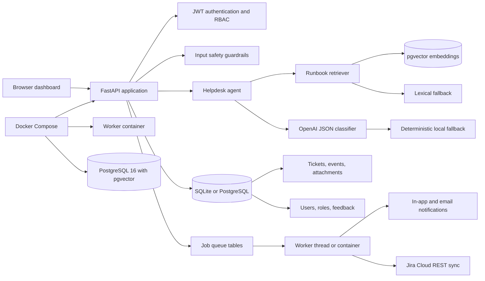
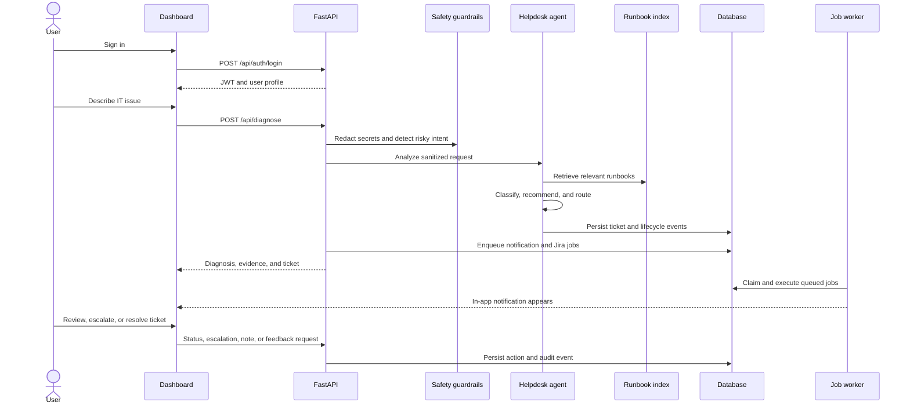

# Relay AI IT Helpdesk

Relay is a production-shaped AI IT helpdesk application. It diagnoses issues, retrieves relevant runbooks, recommends next steps, creates and routes tickets, tracks ticket activity, notifies requesters and watchers, synchronizes with Jira, and protects operations behind JWT authentication, role-based access control, input safety guardrails, and a durable background job queue.

## Contents

- [Architecture diagram](#architecture-diagram)
- [System workflow](#system-workflow)
- [Feature list](#feature-list)
- [API documentation](#api-documentation)
- [Database schema](#database-schema)
- [Ticket lifecycle](#ticket-lifecycle)
- [Background jobs](#background-jobs)
- [Notifications](#notifications)
- [Jira integration](#jira-integration)
- [AI architecture](#ai-architecture)
- [Configuration](#configuration)
- [Security considerations](#security-considerations)
- [Testing](#testing)
- [Docker setup](#docker-setup)
- [CI/CD](#cicd)
- [Screenshots](#screenshots)
- [Demo](#demo)

## Architecture diagram



The browser serves the static dashboard from FastAPI. Protected API routes resolve the authenticated user from a signed JWT. The agent combines retrieval and classification before persisting ticket, conversation, and activity data. Slow or unreliable side effects — Jira synchronization, SLA scans, and notification delivery — are recorded as jobs and executed by a worker instead of inline in the request.

## System workflow



## Feature list

### Diagnosis and automation

- AI diagnosis with intent, confidence, category, priority, summary, actions, and retrieved evidence.
- OpenAI JSON-mode classification when `OPENAI_API_KEY` is configured.
- Deterministic local classification fallback for offline demos.
- Input safety guardrails: secret redaction, prompt-injection detection, and high-impact action blocking.
- Manager approval workflow for tickets that require human review before automation or external actions.

### Ticketing

- Category-based routing with priority-specific SLA deadlines driven by database-backed routing rules.
- Automatic escalation for high-priority categories and manual escalation with a two-hour SLA.
- Guarded status transitions with resolution codes, reopen handling, and close permissions.
- Ticket timelines with actor attribution, internal notes, and requester-visible public replies.
- Ticket attachments with type and size validation plus authenticated download.
- Ticket linking (parent, duplicate, related) and watcher management.
- Conversation persistence for user and assistant messages.

### Team and workspace

- JWT login with persisted users and Argon2 password hashing.
- Role-based access for requesters, agents, managers, and administrators.
- Self-service profile updates and password changes.
- Administrative user creation, role changes, and activation control with last-admin protection.
- Editable routing rules for category ownership, SLA hours, and high-priority auto-escalation.

### Notifications

- Persistent in-app notifications with unread counts and read-state tracking.
- Per-user notification preferences for in-app and email channels.
- Email delivery over SMTP when `SMTP_HOST` is configured.
- Idempotency keys so retried jobs do not send duplicate notifications.

### Operations

- Durable background job queue with retries, backoff, and stale-job recovery.
- Scheduled SLA breach scanning that writes timeline events and notifies requesters and watchers.
- Analytics overview with ticket totals, SLA breaches, automation rate, job health, category and team breakdowns, and seven-day volume.
- Jira Cloud integration for issue creation, status synchronization, comments, and inbound webhooks.
- Knowledge base runbook search, ingestion, file upload, deletion, and role-based visibility.
- Agent helpful/not-helpful feedback and summary metrics.
- Responsive dashboard with login gate, queue, ticket modal, knowledge base, analytics, team administration, and workspace settings.
- SQLite defaults for local development and PostgreSQL with pgvector for Docker deployments.

## API documentation

Start the application and open [http://localhost:8000/docs](http://localhost:8000/docs) for the interactive OpenAPI reference.

Most endpoints require `Authorization: Bearer <token>`. Obtain a token with `POST /api/auth/login`.

### Authentication and profiles

| Method | Endpoint | Access | Description |
| --- | --- | --- | --- |
| `POST` | `/api/auth/login` | Public | Authenticate with email and password. |
| `GET` | `/api/auth/me` | Authenticated | Return the current user profile. |
| `PATCH` | `/api/auth/me` | Authenticated | Update your own name and email address. |
| `POST` | `/api/auth/change-password` | Authenticated | Change your password after verifying the current one. |
| `GET` | `/api/auth/users` | Manager, admin | List users. |
| `POST` | `/api/auth/users` | Admin | Create a user. |
| `PATCH` | `/api/auth/users/{user_id}/active` | Admin | Activate or deactivate a user. |
| `PATCH` | `/api/auth/users/{user_id}/role` | Admin | Change a user role. Blocks removing the last active administrator. |

### Diagnosis and conversations

| Method | Endpoint | Access | Description |
| --- | --- | --- | --- |
| `POST` | `/api/diagnose` | Authenticated | Diagnose an issue and optionally create a ticket. |
| `POST` | `/api/conversations` | Authenticated | Create a conversation. |
| `GET` | `/api/conversations` | Authenticated | List conversations visible to the user. |
| `GET` | `/api/conversations/{conversation_id}` | Authenticated | Retrieve a conversation and its messages. |
| `POST` | `/api/conversations/{conversation_id}/messages` | Authenticated | Add a message and receive an agent diagnosis. |

### Tickets and activity

| Method | Endpoint | Access | Description |
| --- | --- | --- | --- |
| `GET` | `/api/tickets` | Authenticated | List tickets with `status`, `priority`, and `q` filters. |
| `POST` | `/api/tickets` | Authenticated | Create and route a ticket for the current requester. |
| `GET` | `/api/tickets/{ticket_id}` | Authenticated | Retrieve ticket details. |
| `GET` | `/api/tickets/{ticket_id}/events` | Authenticated | Retrieve the activity timeline. Requesters see public events only. |
| `POST` | `/api/tickets/{ticket_id}/events` | Authenticated | Add a note or reply. Requesters can only post public replies. |
| `POST` | `/api/tickets/{ticket_id}/attachments` | Authenticated | Upload an attachment (10 MB limit, allowlisted types). |
| `GET` | `/api/tickets/{ticket_id}/attachments` | Authenticated | List ticket attachments. |
| `GET` | `/api/attachments/{attachment_id}/download` | Authenticated | Download an attachment with requester scoping. |
| `POST` | `/api/tickets/{ticket_id}/links` | Agent, manager, admin | Link a parent, duplicate, or related ticket. |
| `POST` | `/api/tickets/{ticket_id}/watchers` | Agent, manager, admin | Add or remove a ticket watcher. |
| `PATCH` | `/api/tickets/{ticket_id}/status` | Agent, manager, admin | Change ticket status with transition validation. |
| `POST` | `/api/tickets/{ticket_id}/escalate` | Agent, manager, admin | Escalate a ticket and assign a two-hour SLA. |
| `POST` | `/api/tickets/{ticket_id}/approve` | Manager, admin | Approve a safety review so automation can continue. |
| `POST` | `/api/tickets/{ticket_id}/sync` | Agent, manager, admin | Force a Jira synchronization for a ticket. |

### Routing rules

| Method | Endpoint | Access | Description |
| --- | --- | --- | --- |
| `GET` | `/api/routing/rules` | Agent, manager, admin | List category routing rules. Seeds defaults on first read. |
| `PUT` | `/api/routing/rules` | Manager, admin | Create or update a category rule (team, SLA hours, auto-escalation). |

### Notifications

| Method | Endpoint | Access | Description |
| --- | --- | --- | --- |
| `GET` | `/api/notifications` | Authenticated | List up to 50 notifications with `items` and `unread_count`. |
| `PATCH` | `/api/notifications/{notification_id}/read` | Authenticated | Mark one notification as read. |
| `POST` | `/api/notifications/read-all` | Authenticated | Mark every unread notification as read. |
| `GET` | `/api/notifications/preferences` | Authenticated | Read your notification preferences. |
| `PUT` | `/api/notifications/preferences` | Authenticated | Update your notification preferences. |

### Operations, analytics, and feedback

| Method | Endpoint | Access | Description |
| --- | --- | --- | --- |
| `GET` | `/api/health` | Public | Check service health and job statistics. |
| `GET` | `/api/stats` | Authenticated | Return dashboard summary metrics. |
| `GET` | `/api/analytics/overview` | Agent, manager, admin | Totals, SLA breaches, automation rate, job health, category, team, priority, status, and daily volume. |
| `GET` | `/api/jobs` | Manager, admin | List recent jobs, optionally filtered by `status`. |
| `GET` | `/api/jobs/{job_id}` | Manager, admin | Retrieve one job. |
| `POST` | `/api/jobs/{job_id}/retry` | Manager, admin | Requeue a failed or completed job. |
| `POST` | `/api/jobs/sla-scan` | Manager, admin | Queue an immediate SLA breach scan. |
| `POST` | `/api/feedback` | Authenticated | Record agent feedback. |
| `GET` | `/api/feedback/summary` | Manager, admin | View feedback totals. |

### Knowledge base

| Method | Endpoint | Access | Description |
| --- | --- | --- | --- |
| `GET` | `/api/docs` | Authenticated | List or search runbooks, filtered by `q` and `category`. |
| `GET` | `/api/docs/{doc_id}` | Authenticated | Retrieve one runbook if your role meets its `min_role`. |
| `POST` | `/api/docs` | Manager, admin | Add a runbook from text. |
| `POST` | `/api/docs/upload` | Manager, admin | Ingest a PDF, DOCX, TXT, Markdown, CSV, JSON, or HTML file. |
| `DELETE` | `/api/docs/{doc_id}` | Manager, admin | Delete a runbook and its chunks. |

### Integrations

| Method | Endpoint | Access | Description |
| --- | --- | --- | --- |
| `GET` | `/api/integrations/jira/status` | Admin | Report Jira configuration, auto-sync state, and project. |
| `POST` | `/api/integrations/jira/test` | Admin | Verify Jira credentials against the Jira Cloud API. |
| `POST` | `/api/webhooks/jira` | Jira webhook token | Update a linked ticket from a Jira issue status change. |

## Database schema

SQLAlchemy defines the following tables:

| Table | Purpose | Important fields |
| --- | --- | --- |
| `users` | Authenticated identities | `email`, `password_hash`, `role`, `is_active` |
| `routing_rules` | Category ownership and SLA policy | `category`, `team`, `sla_hours`, `auto_escalate_high`, `updated_by` |
| `tickets` | Helpdesk work items | `ticket_number`, `requester_email`, `category`, `priority`, `status`, `assignee`, `sla_due_at`, `escalation_reason`, `resolution_code`, `requires_approval`, `approved_by`, `watchers`, `related_ticket_ids` |
| `ticket_events` | Ticket audit timeline | `ticket_id`, `event_type`, `actor`, `message`, `details`, `visibility` |
| `ticket_attachments` | Files attached to tickets | `ticket_id`, `filename`, `content_type`, `storage_path`, `size_bytes`, `uploaded_by` |
| `knowledge_documents` | Runbook records | `title`, `category`, `source`, `min_role`, `status`, `chunk_count`, `content_hash` |
| `knowledge_chunks` | Chunked runbook text and vectors | `document_id`, `chunk_index`, `content`, `embedding`, `chunk_metadata` |
| `conversations` | User support sessions | `user_email`, `status`, `created_at`, `updated_at` |
| `conversation_messages` | Conversation history | `conversation_id`, `role`, `content`, `payload` |
| `agent_feedback` | Diagnosis feedback | `run_id`, `ticket_number`, `rating`, `comment` |
| `notifications` | Queued and delivered notifications | `user_id`, `notification_type`, `title`, `message`, `read_at`, `idempotency_key` |
| `notification_preferences` | Per-user delivery settings | `in_app_enabled`, `email_enabled`, `email_on_assignment`, `email_on_status_change`, `email_on_sla_breach` |
| `jobs` | Background job queue | `job_type`, `status`, `payload`, `result`, `attempts`, `max_attempts`, `run_after`, `locked_by`, `last_error` |

Ticket attachments are written under `app/data/uploads/{ticket_id}/` and served through the authenticated download endpoint rather than as static files.

The local SQLite database is created automatically. Existing SQLite databases receive missing ticket columns during startup. For production schema evolution, use a migration tool such as Alembic instead of the startup alteration logic in `app/models.py`.

## Ticket lifecycle

Statuses are constrained to `Open`, `In progress`, `Pending`, `Escalated`, `Needs review`, `Resolved`, `Closed`, and `Reopened`. `app/lifecycle.py` validates every transition:

| From | Allowed next statuses |
| --- | --- |
| `Open` | `In progress`, `Pending`, `Escalated`, `Needs review`, `Resolved` |
| `In progress` | `Pending`, `Escalated`, `Resolved` |
| `Pending` | `In progress`, `Resolved`, `Closed` |
| `Escalated` | `In progress`, `Pending`, `Resolved` |
| `Needs review` | `Open`, `In progress`, `Escalated` |
| `Resolved` | `Closed`, `Reopened`, `In progress` |
| `Closed` | `Reopened` |
| `Reopened` | `In progress`, `Pending`, `Escalated`, `Resolved` |

Additional rules:

- Only managers and administrators can close a ticket.
- Tickets that require approval cannot change status or sync externally until a manager approves them.
- Resolving a ticket records a resolution code from `Fixed`, `Workaround`, `User education`, `Duplicate`, `Not reproducible`, or `No action`.
- Reopening clears the resolution code and closed timestamp.

SLA health is derived from the due date rather than stored as a status:

| State | Condition |
| --- | --- |
| `complete` | Ticket is `Resolved` or `Closed`. |
| `not_set` | No SLA due date is recorded. |
| `breached` | The due date has passed. |
| `at_risk` | One hour or less remains. |
| `on_track` | More than one hour remains. |

## Background jobs

Relay records slow or unreliable work as rows in the `jobs` table and executes them from a worker, so a slow Jira API or SMTP server never blocks an HTTP request.

| Job type | Purpose | Idempotency |
| --- | --- | --- |
| `jira_sync` | Create or update the linked Jira issue and add a comment. | Keyed by ticket, status, and comment hash. |
| `sla_scan` | Find breached tickets, write `sla_breach` timeline events, and notify requesters and watchers. | Keyed by hour. |
| `send_notification` | Deliver one queued notification over its channel. | Keyed by notification id. |

Worker behavior:

- The worker claims the oldest due job, marks it `running`, and increments `attempts`.
- A failed job is retried with exponential backoff of `min(900, 2^(attempts - 1) * 10)` seconds until `max_attempts` is reached, then marked `failed` with `last_error` recorded.
- On startup the worker requeues jobs that have been `running` for more than ten minutes, so a crashed process does not strand work.
- The worker enqueues an `sla_scan` job every five minutes and polls for new work once per second.
- Set `RUN_WORKER=true` to run the worker as a thread inside the API process for local development, or `RUN_WORKER=false` and run the dedicated worker container (`python -m app.worker`) in production.
- Managers and administrators can inspect jobs with `GET /api/jobs`, requeue them with `POST /api/jobs/{job_id}/retry`, and trigger a scan on demand with `POST /api/jobs/sla-scan`.

## Notifications

Notifications are persisted rows rather than fire-and-forget messages, so unread state survives page reloads and retries cannot duplicate deliveries.

- **Channels.** `in_app` notifications appear in the dashboard notification panel. `email` notifications are delivered over SMTP.
- **Recipients.** A ticket notification targets the requester and every watcher on the ticket.
- **Preferences.** Each user controls `in_app_enabled`, `email_enabled`, and `email_on_sla_breach` from the Settings view. Preferences are created on first access with all channels enabled.
- **Idempotency.** Every notification carries an `idempotency_key` derived from the notification type, user, ticket, and a dedupe suffix, so a retried job does not create a second row.
- **Delivery.** `create_notification` records the row and enqueues a `send_notification` job. The worker performs the actual channel delivery and records `status`, `sent_at`, or `error`.
- **Email gating.** Email delivery is skipped when `SMTP_HOST` is empty or the user has disabled email notifications. No SMTP server is required for local development.
- **Read state.** `PATCH /api/notifications/{id}/read` marks a single notification and `POST /api/notifications/read-all` marks all unread notifications. `GET /api/notifications` returns the newest 50 notifications plus an `unread_count`.

The administrator account receives a welcome notification on first startup so the notification panel is not empty in a fresh environment.

## Jira integration

Relay synchronizes tickets with Jira Cloud over the REST API v3 using email and API token authentication.

| Variable | Purpose |
| --- | --- |
| `JIRA_BASE_URL` | Your Atlassian site, for example `https://your-domain.atlassian.net`. |
| `JIRA_EMAIL` | Service account email used for the API token. |
| `JIRA_API_TOKEN` | Atlassian API token for the service account. |
| `JIRA_PROJECT_KEY` | Project key that receives Relay issues. |
| `JIRA_ISSUE_TYPE` | Issue type for created issues. Defaults to `Task`. |
| `JIRA_AUTO_SYNC` | When true, Relay queues Jira sync jobs automatically. |
| `JIRA_WEBHOOK_SECRET` | Shared token that authenticates inbound Jira webhooks. |

Status mapping from Relay to Jira:

| Relay status | Jira transition target |
| --- | --- |
| `Open` | `Open` |
| `In progress` | `In Progress` |
| `Pending` | `Waiting for customer` |
| `Escalated` | `In Progress` |
| `Needs review` | `Open` |
| `Resolved` | `Done` |
| `Closed` | `Done` |
| `Reopened` | `In Progress` |

Behavior and guardrails:

- The integration is considered configured only when the base URL, email, API token, and project key are all present. `GET /api/integrations/jira/status` and `POST /api/integrations/jira/test` let administrators verify this.
- Tickets that require approval are blocked from creating or updating Jira issues until a manager approves them.
- When `JIRA_AUTO_SYNC` is enabled, synchronization is queued as a `jira_sync` job keyed by ticket, status, and comment hash. Otherwise the call runs inline and no-ops when Jira is not configured.
- Inbound webhooks carry the shared secret in the `x-jira-webhook-token` header and are rejected with `401` when it is missing or wrong.
- An inbound status change updates only tickets already linked through `external_id`; unknown issues are ignored rather than created.
- Sync failures are stored on the ticket as `sync_error` with the last successful timestamp in `last_synced_at`.

## AI architecture

1. The API validates the incoming request with Pydantic.
2. `app/safety.py` redacts credentials and tokens, flags prompt-injection attempts, and detects high-impact requests such as permission changes or destructive commands.
3. `app/rag.py` retrieves evidence from the knowledge index.
4. `app/llm.py` asks the configured OpenAI model for structured JSON classification when an API key is available.
5. `app/safety.py` constrains the model response: categories, priorities, and confidence are bounded, unsafe recommended actions are removed, and approval is required when guardrails fire.
6. A deterministic local classifier handles common VPN, password, Slack, and laptop issues without credentials.
7. `app/routing.py` selects the owning team, calculates the SLA from the stored routing rule, and determines escalation.
8. The result and ticket lifecycle events are persisted and returned to the dashboard.

Retrieval is layered:

- **Vector search.** On PostgreSQL with the `vector` extension, runbook chunks are embedded and ranked by cosine distance.
- **Lexical fallback.** SQLite, or a temporarily unavailable pgvector extension, falls back to token-overlap scoring that weights title matches.
- **Legacy seed.** `app/data/documents.json` seeds the knowledge base on first startup and is used directly when no database session is available.

Documents are chunked at roughly 900 characters with 120 characters of overlap and carry a `min_role`, so requesters, agents, managers, and administrators each see only the runbooks their role permits. The retriever interface is isolated so the embedding model can be changed without touching the API contract.

## Configuration

Copy `.env.example` to `.env` and adjust these values. Every setting is read once at import time in `app/core.py`.

| Variable | Default | Purpose |
| --- | --- | --- |
| `DATABASE_URL` | `sqlite:///./helpdesk.db` | SQLAlchemy connection string. Use `postgresql+psycopg://` for PostgreSQL. |
| `OPENAI_API_KEY` | unset | Enables OpenAI classification and provider embeddings. |
| `OPENAI_MODEL` | `gpt-4o-mini` | Chat model used for classification. |
| `EMBEDDING_MODEL` | `text-embedding-3-small` | Embedding model used for runbook vectors. |
| `JWT_SECRET` | `local-only-change-this-secret` | Signing secret for access tokens. Replace before deployment. |
| `JWT_ALGORITHM` | `HS256` | JWT signing algorithm. |
| `ACCESS_TOKEN_MINUTES` | `480` | Access token lifetime in minutes. |
| `ADMIN_EMAIL` | `admin@acme.co` | Seeded administrator email. |
| `ADMIN_PASSWORD` | `relay-demo-2026` | Seeded administrator password. |
| `ADMIN_NAME` | `Acme Administrator` | Seeded administrator display name. |
| `JIRA_BASE_URL` | empty | Jira Cloud site URL. |
| `JIRA_EMAIL` | empty | Jira service account email. |
| `JIRA_API_TOKEN` | empty | Jira API token. |
| `JIRA_PROJECT_KEY` | empty | Jira project that receives issues. |
| `JIRA_ISSUE_TYPE` | `Task` | Jira issue type for created issues. |
| `JIRA_AUTO_SYNC` | `false` | Queue Jira synchronization as background jobs. |
| `JIRA_WEBHOOK_SECRET` | empty | Shared token required by the inbound Jira webhook. |
| `SMTP_HOST` | empty | SMTP server host. Email notifications are skipped when empty. |
| `SMTP_PORT` | `587` | SMTP server port. |
| `SMTP_USERNAME` | empty | SMTP username. Authentication is skipped when empty. |
| `SMTP_PASSWORD` | empty | SMTP password. |
| `SMTP_FROM` | `relay@acme.co` | From address for outbound email. |
| `SMTP_TLS` | `true` | Issue `STARTTLS` before authenticating. |
| `RUN_WORKER` | `true` | Run the job worker thread inside the API process. Set to `false` when running the worker container. |
| `CORS_ORIGINS` | `*` | Comma-separated list of allowed browser origins. |

Administrator seeding runs on startup: if the configured `ADMIN_EMAIL` does not exist, Relay creates it with the `admin` role and adds a welcome notification.

## Security considerations

- Passwords are stored as Argon2 hashes through `pwdlib`; plaintext passwords are not persisted.
- Access tokens are signed JWTs with expiration and an algorithm configured through environment variables.
- Inactive users cannot authenticate, and tokens for deactivated accounts are rejected on every request.
- Requesters can only access their own conversations and tickets, and they only see public timeline entries.
- Agent, manager, and administrator actions are protected with explicit role checks.
- Administrators cannot change their own role, deactivate their own account, or remove the last active administrator.
- User-provided content is validated with length and format constraints.
- Ticket attachments are limited to 10 MB and an allowlist of content types; knowledge uploads accept PDF, DOCX, TXT, Markdown, CSV, JSON, and HTML.
- Attachment filenames are reduced to their base name with `..` stripped, stored per ticket under `app/data/uploads/`, and served only through an authenticated, access-checked download endpoint.
- Diagnosis input is scanned for secrets, prompt-injection attempts, and high-impact actions before it reaches the model; flagged tickets require manager approval before further automation or external actions.
- The frontend escapes dynamic text before inserting it into HTML.
- Replace demo credentials, `JWT_SECRET`, and wildcard CORS before deployment.
- Keep `.env` files, local databases, uploaded files, and API keys outside source control.
- Add HTTPS, secret management, rate limiting, and token revocation for production.

## Testing

Install development dependencies and run the API suite:

```bash
python -m venv .venv
# Windows PowerShell
.\.venv\Scripts\Activate.ps1
# macOS/Linux
source .venv/bin/activate
pip install -r requirements-dev.txt
pytest -q
```

`tests/test_api.py` points `DATABASE_URL` at a throwaway SQLite file, authenticates as the seeded administrator, and exercises the following:

- Authenticated profile retrieval.
- Health and seeded dashboard metrics.
- Diagnosis without ticket creation.
- Conversation persistence across two messages.
- Runbook ingestion from text and from an uploaded file, plus deletion.
- Agent feedback submission.
- Jira status reporting and webhook rejection when unconfigured.
- Safety guardrails that redact secrets and force approval, followed by manager approval.
- Ticket lifecycle transitions through `Pending`, `In progress`, `Resolved`, `Closed`, and `Reopened`.
- Analytics overview, routing rule updates, profile updates, and notification preferences.
- Team user creation, role change, and deactivation.
- Ticket timeline retrieval and manual note creation.

## Docker setup

The Docker Compose stack runs PostgreSQL 16 with pgvector, the API, and a dedicated worker:

```bash
docker compose up --build
```

Then open [http://localhost:8000](http://localhost:8000). Configure `OPENAI_API_KEY`, `JWT_SECRET`, and administrator values in `.env` before sharing the deployment. To stop the stack:

```bash
docker compose down
```

Services:

- `db` runs `pgvector/pgvector:pg16` and stores data in the `relay_postgres_data` volume.
- `api` builds the application image, runs `uvicorn app.main:app`, and starts with `RUN_WORKER=false` so background work is not duplicated.
- `worker` runs the same image with `python -m app.worker` to process queued jobs independently of the API.

The PostgreSQL data volume persists across container restarts. The API creates the `vector` extension and its tables on startup, so no manual migration step is required for a fresh volume.

## CI/CD

There is currently no CI workflow checked into this repository. A recommended pipeline should:

1. Install `requirements-dev.txt`.
2. Run `pytest -q` against SQLite.
3. Build the Docker image.
4. Start the container and check `GET /api/health`.
5. Publish and deploy only from protected branches.

Keep production secrets in the CI/CD platform's secret store, not in workflow files or the repository.

## Screenshots

The application currently includes these primary views:

- Login gate with email and password authentication.
- Overview with operational health, summary metrics, and the Relay AI diagnosis composer.
- AI diagnosis result with recommended actions and retrieved evidence.
- Ticket queue with status filtering and an expandable full-queue view.
- Ticket details modal with SLA data, activity timeline, notes, status updates, escalation, attachments, links, and watchers.
- Knowledge base runbook list with an expandable full-library view and manager upload controls.
- Analytics view with totals, SLA breaches, automation rate, job health, seven-day volume, category and team breakdowns, and AI feedback quality.
- Team and routing view with role selectors, activation controls, and editable routing rules.
- Settings view with profile, password, notification preferences, and connected-service health.
- Notification panel with unread badge and mark-all-read control.

Add committed screenshots under `docs/screenshots/` when visual regression references are available. No screenshot assets are currently included in the repository.

## Demo

### Local demo

```bash
python -m venv .venv
# Windows PowerShell
.\.venv\Scripts\Activate.ps1
# macOS/Linux
source .venv/bin/activate
pip install -r requirements-dev.txt
uvicorn app.main:app --reload --host 127.0.0.1 --port 8000
```

Visit [http://127.0.0.1:8000](http://127.0.0.1:8000) and sign in with the configured administrator account. The default local demo credentials are:

```text
Email: admin@acme.co
Password: relay-demo-2026
```

On first startup Relay seeds the administrator, five routing rules, the runbook index, and four demo tickets so the queue, analytics, and dashboard metrics are populated immediately. The in-process worker is enabled by default locally, so queued notifications and SLA scans run without extra setup.

Change these values through `ADMIN_EMAIL`, `ADMIN_PASSWORD`, and `ADMIN_NAME` before using the application outside a local demo.

### Docker demo

```bash
docker compose up --build
```

The Docker API is available at [http://localhost:8000](http://localhost:8000), with interactive API documentation at [http://localhost:8000/docs](http://localhost:8000/docs).
